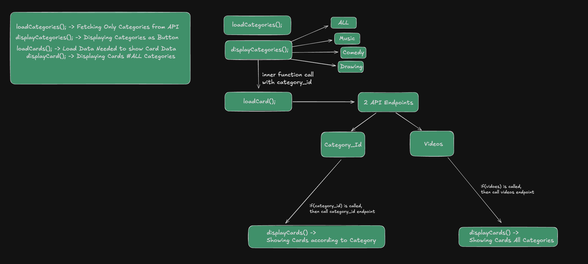

# MiniTube-API-Fetch-Project

A video browsing app built with vanilla JavaScript, Tailwind CSS, and DaisyUI, using the Programming Hero Phero-Tube API.

## Diagram

## Features

- Dynamic navbar (logo, search, sort)
- Categories loaded from the API with active state
- Videos loaded per category, with verified badge and view count
- "No content" state when a category has no videos

## Tech Stack

- HTML, Tailwind CSS, DaisyUI
- Vanilla JavaScript

## Run Locally

Just open `index.html` in your browser — no build step needed.

## Not Done Yet

- Search
- Sort
- Video details modal
